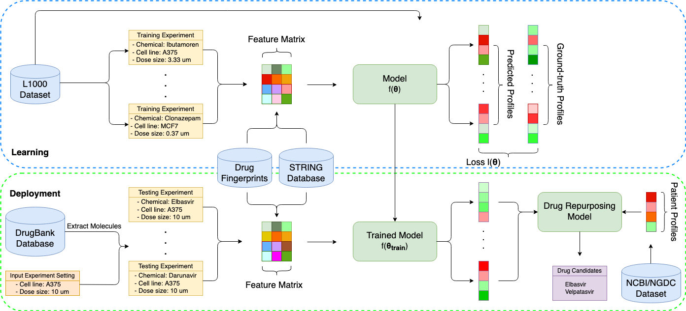

# DeepCE - A novel and robust deep learning framework for high-throughput mechanism-driven phenotype compound screening
-----------------------------------------------------------------
Code by **Thai-Hoang Pham** at Ohio State University.

## 1. Introduction
**DeepCE** is a Python implementation of the mechanism-driven neural network-based model which captures 
high-dimensional associations among biological features as well as non-linear relationships between biological features 
and outputs to predict gene expression profiles given a chemical compound.

**DeepCE** achieves state-of-the-art results of predicting gene expression profiles compared to other models not only 
in *de novo* chemical setting but also in the traditional imputation setting. More importantly, **DeepCE** is shown to be 
effective in the challenge and urgent problem, finding treatment for **COVID-19**. In summary, **DeepCE** could be a powerful 
tool for phenotype-based compound screening. 

## 2. Pipeline



Figure 1: General framework of training DeepCE for L1000 gene expression profile prediction and using it for 
downstream application (i.e. drug repurposing). The objective for the learning process is minimizing the loss 
between predicted profiles and grouth-truth profiles in L1000 dataset. After training, DeepCE is used for 
generating profiles for new chemicals in external molecular database (e.g. DrugBank, ChEMBL). These profiles 
are then used for in silico screening to find potential drugs for disease treatment

## 3. Installation

**DeepCE** depends on Numpy, SciPy, PyTorch (CUDA toolkit if use GPU), scikit-learn, and RDKit. 
You must have them installed before using **DeepCE**.

The simple way to install them is using conda:

```sh
	$ conda install numpy scipy scikit-learn rdkit pytorch
```
## 4. Usage

### 4.1. Data

The datasets used to train **DeepCE** are located at folder ``DeepCE/data/``

### 4.2. Training DeepCE

The training script for **DeepCE** is located at folder ``script/``

```sh
    $ cd script
    $ bash train_deepce.sh
```

Arguments in this scripts:

* ``--drug_file``:       path for SMILES representation file
* ``--gene_file``:         path for L1000 gene feature file
* ``--train_file``:        path for L1000 gene expression training data
* ``--dev_file``:        path for L1000 gene expression development data
* ``--test_file``:      path for L1000 gene expression testing data
* ``--dropout``: dropout value used in DeepCE
* ``--batch_size``:       batch size value for each training step
* ``--max_epoch``:     maximum number of training iterations

### 4.3. Getting chemical-induced gene expression profiles for all drug in Drugbank

Beside **DeepCE** source code, we also publicize the chemical-induced gene expression profiles generated from **DeepCE** at 8 
cell lines including *A375*, *A549*, *HA1E*, *HELA*, *HT29*, *MCF7*, *PC3*, and *YAPC* for all drugs (i.e. 11179 drugs) 
in Drugbank. We hope that this dataset could make significant a contribution to drug discovery and development in 
particular, and computational chemistry and biology research in general.

The script for getting these chemical-induced gene expression profiles is located at folder ``script/``

```sh
    $ cd script
    $ bash get_gene_expression_data.sh
```

The downloaded dataset will be located at folder ``DeepCE/data/drugbank_gene_expression/``

## 5. Contact

**Thai-Hoang Pham** < pham.375@osu.edu >

Department of Computer Science and Engineering, Ohio State University, USA
